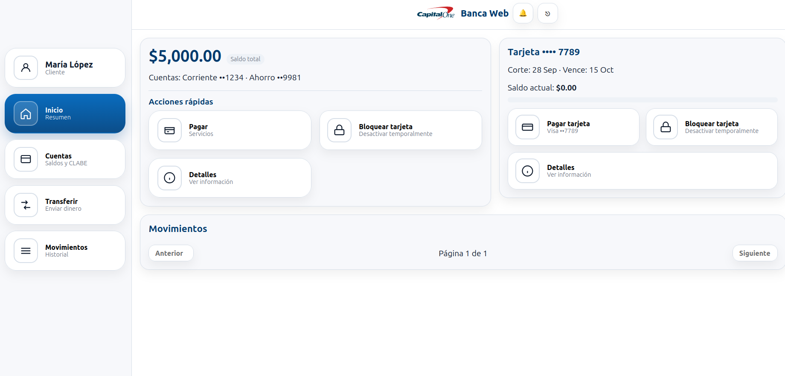
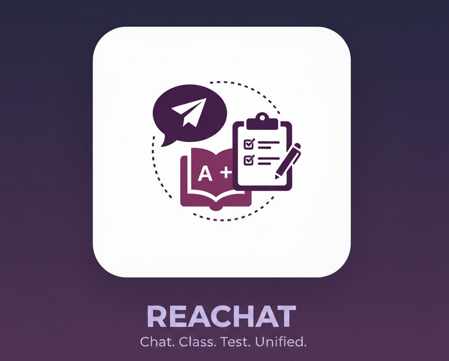

<h1 align="center">Hi, I am <a href="https://luishidalgo-git.github.io/Portfolio/">Luis Angel</a> 👋</h1>

## About me

- ⭐ Github Star ⭐ 
- 📊​ Backend Developer
- 🎥 I'll teach you how to programme apps in [Youtube](https://www.youtube.com/channel/UC7RfFxPIDUk45fXLUfND3RQ?sub_confirmation=1)
- ✏️ Contact me by [Email](hidalgovazquezluisangel2004@gmail.com)

## Best *Projects*
<table>
<tr>
<td width="50%">
<h3 align="center">Capital One Fintech</h3>

 Three-in-one chat, subject and assessment system for teachers and students, with reCaptcha authentication.

                                                                                      
</td>

<td width="50%">
                
<h3 align="center">Reachat</h3>

                                       

 

A payment system with an AI assistant that learns your movements and gives you suggestions on how to move and save more. 

                                                             
</table>                                                                                 

 

<table>
<tr>
<td width="50%">
<h3 align="center">Esimaldar</h3>

A classic horror game set in a school. You must enter the premises at night to retrieve the books you left behind, but you realise that the longer you stay inside, the more supernatural things happen, and you must remain alert.

                                                                                      
</td>       

<!-- <td width="50%">
<h3 align="center">Curso Kotlin Multiplatform</h3>

Aprende a programar aplicaciones <strong>multiplataform con Kotlin y Jetpack Compose</strong> - En este curso nos centraremos en dominar Kotlin Multiplatform <strong>desde cero</strong>. Curso <strong>GRATUITO</strong> (en desarrollo) con todo el código disponible para descargar.

                                                                                      
</td>   -->
</table>                                                                                 

 

### ⚙️ &nbsp;GitHub Analytics

